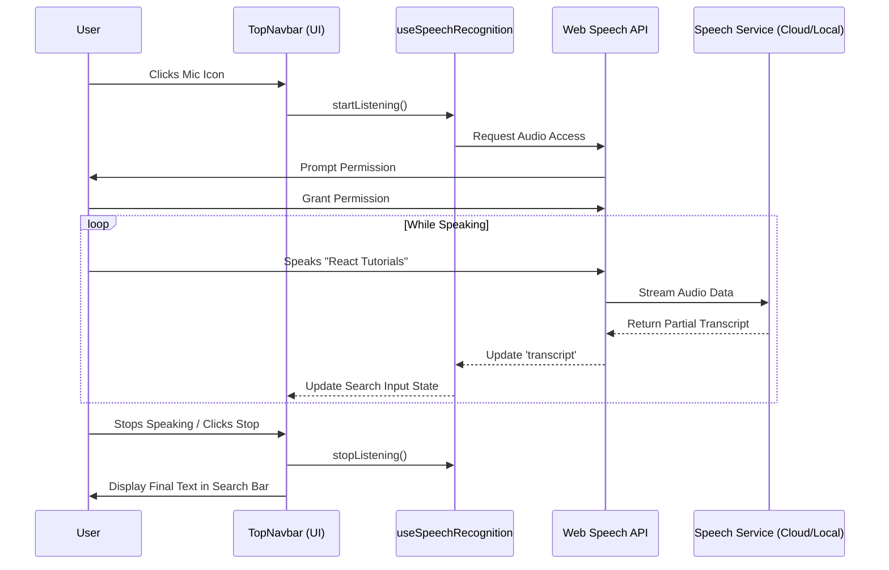

# Voice Interaction Features: Technical Explanation

This document details the implementation, logic, and internal working of the two voice-based features integrated into the VidFlow platform: **Voice Search** and **In-Video Voice Commands**.

---

## 1. Voice Search (Speech-to-Text)

### **Overview**
Voice Search allows users to dictate their search queries instead of typing. It leverages the browser's native capabilities to convert speech into text in real-time.

### **Technology Stack**
*   **Library**: `react-speech-recognition`
*   **Underlying API**: **Web Speech API** (`window.SpeechRecognition` or `window.webkitSpeechRecognition`).
*   **Polyfill**: `regenerator-runtime` (ensures asynchronous generator support across browsers).

### **How It Works (The Logic)**
1.  **Initialization**: The `useSpeechRecognition` hook checks if the browser supports the API.
2.  **Activation**: When the user clicks the **Microphone Icon** in the `TopNavbar`, `SpeechRecognition.startListening()` is called.
3.  **Real-Time Transcription**:
    *   The browser captures audio input.
    *   It sends the audio data to the browser vendor's speech recognition service (e.g., Google's servers for Chrome) or processes it locally (depending on the browser/OS).
    *   The API returns a `transcript` string that updates continuously as the user speaks.
4.  **Synchronization**: A `useEffect` hook listens for changes in the `transcript` and updates the local `searchQuery` state immediately.
5.  **Termination**: When the user stops speaking or clicks the button again, listening stops, and the final text remains in the search bar, ready for submission.

### **Data Flow Diagram**



---

## 2. In-Video Voice Commands (Speech Control)

### **Overview**
This feature enables hands-free control of the video player. Users can issue verbal commands like "Play", "Pause", or "Mute" to control playback without touching the mouse or keyboard.

### **Technology Stack**
*   **Library**: `react-speech-recognition` (running in continuous mode).
*   **Pattern Matching**: Fuzzy string matching (provided by the library) to handle slight variations in pronunciation.

### **How It Works (The Logic)**
1.  **Command Definition**: We define a `commands` array containing objects with:
    *   `command`: A list of keywords (e.g., `['play', 'start', 'resume']`).
    *   `callback`: The function to execute when a match is found.
    *   `fuzzyMatchingThreshold`: A value (0.2) allowing for ~80% accuracy matches (handles accents/noise).
2.  **Ref Integration**: The `VideoPlayer` component uses a `useRef` (`videoRef`) to access the underlying HTML5 `<video>` element directly.
3.  **Execution Loop**:
    *   When **Voice Control** is toggled ON, the browser listens continuously.
    *   The library parses incoming speech against the defined `commands` list.
    *   If a match is found (e.g., user says "Stop"), the corresponding callback triggers `videoRef.current.pause()`.
4.  **Visual Feedback**: A temporary state `feedback` is set (e.g., "⏸ Paused"), which renders a glass-morphism overlay on the video to confirm the action to the user.

### **Internal Architecture & Logic Flow**

```mermaid
flowchart TD
    A[User Activates Voice Control] --> B{Listening State}
    B -->|Active| C[Capture Audio Stream]
    C --> D[Speech Recognition Engine]
    D --> E{Match Command?}
    
    E -- Yes: 'Play' --> F[Execute: videoRef.current.play()]
    E -- Yes: 'Pause' --> G[Execute: videoRef.current.pause()]
    E -- Yes: 'Mute' --> H[Execute: videoRef.current.muted = true]
    E -- No Match --> B
    
    F --> I[Show Feedback Overlay: '▶ Playing']
    G --> I[Show Feedback Overlay: '⏸ Paused']
    H --> I[Show Feedback Overlay: '🔇 Muted']
    
    I --> J[Clear Feedback after 2s]
```

### **Key Concepts**
*   **Continuous Listening**: Unlike search (which stops after one sentence), this mode stays active to accept multiple commands over time.
*   **Direct DOM Manipulation**: We bypass standard React state for playback control (using `ref`) to ensure instant responsiveness without re-rendering the entire video component unnecessarily.
*   **Fuzzy Matching**: Essential for accessibility. It ensures that "Pause video" and "Pause" both trigger the same action, making the system more robust to natural language variations.
